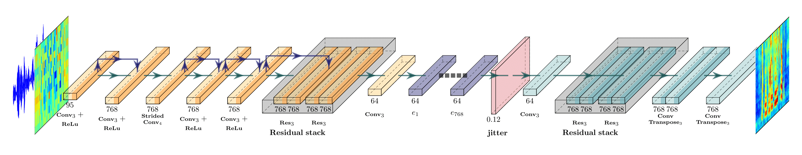
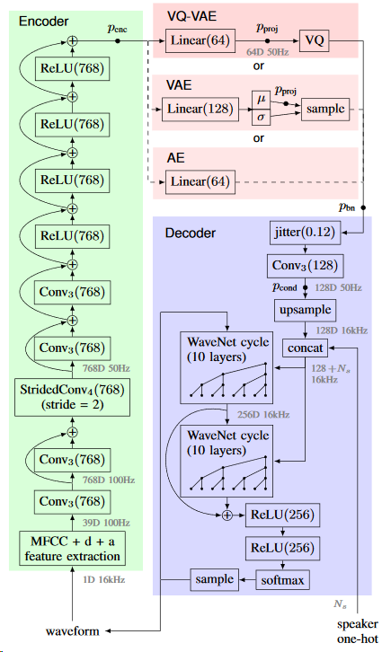
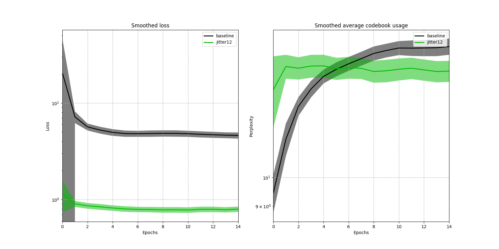
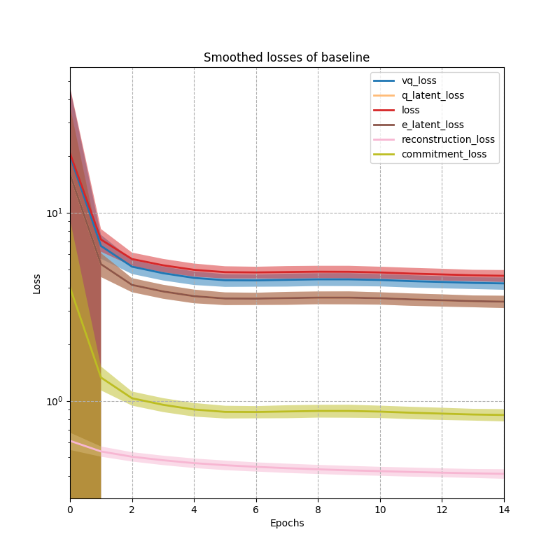
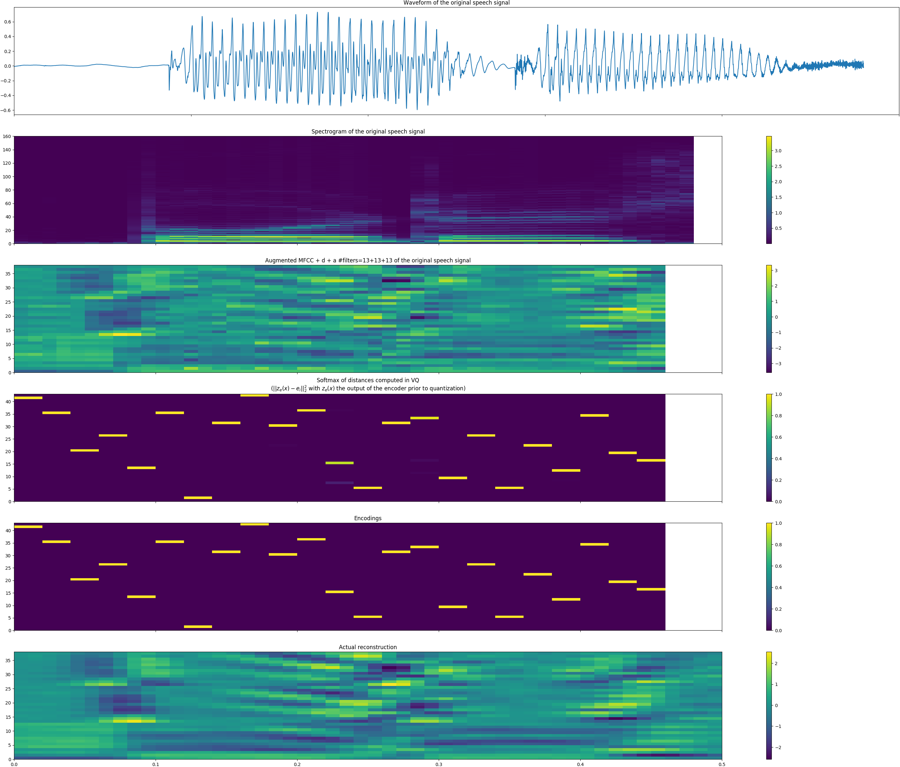
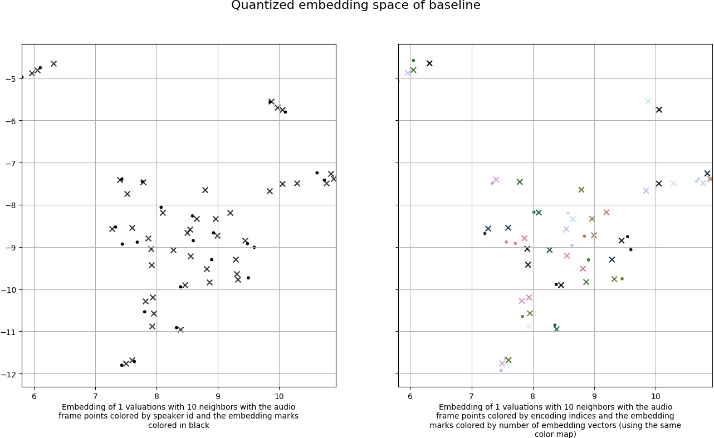
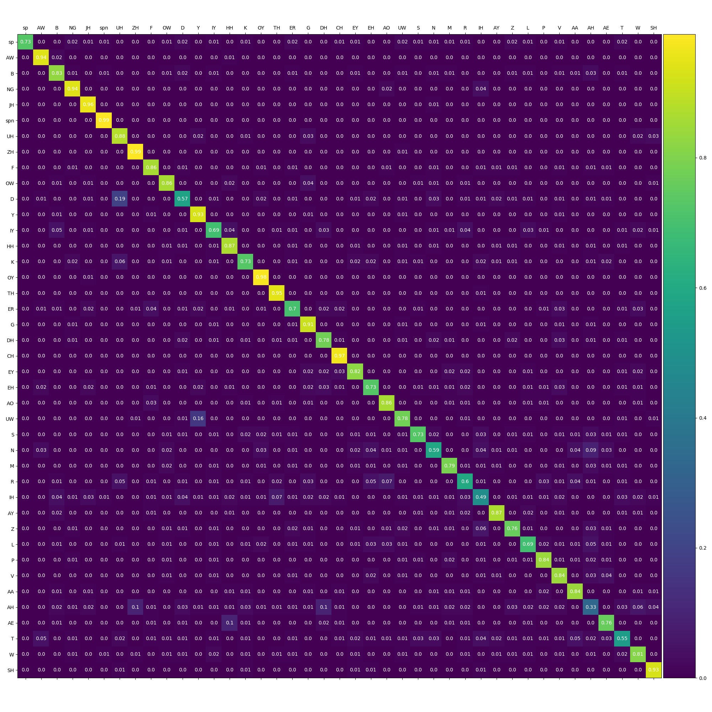
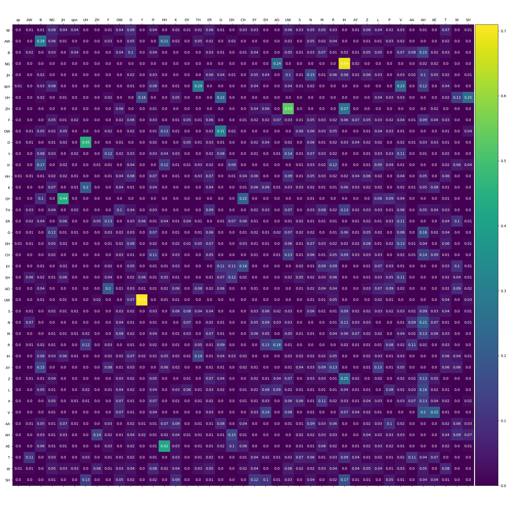
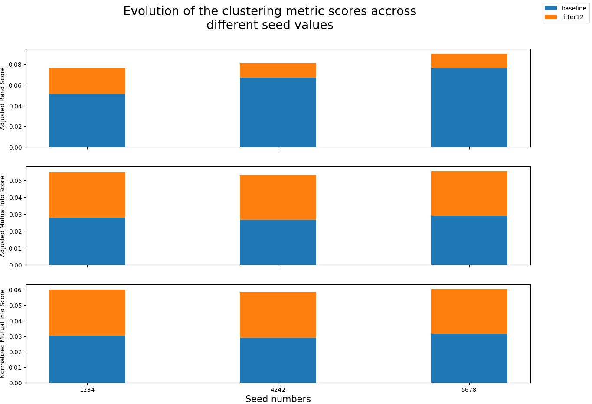

# Overview

PyTorch implementation of VQ-VAE + WaveNet by [Chorowski et al., 2019] and VQ-VAE on speech signals by [van den Oord et al., 2017].

The WaveNet [van den Oord et al., 2016] implementation is from [r9y9/wavenet_vocoder]. The VQ [van den Oord et al., 2016] implementation is inspired from [zalandoresearch/pytorch-vq-vae] and [deepmind/sonnet]. The ClariNet [Ping et al., 2018] and FloWaveNet [Kim et al., 2018] implementations are respectively from [ksw0306/ClariNet] and [ksw0306/FloWaveNet], but are not connected to the WaveNet decoder for now.

# Disclaimer

* The code is actively changing;
* For now instead of a Wavenet it's a deconvolutional NN to speed up my tests;
* For now we are focusing on the evaluation of the VQ, and not on computing good audio samples.

# Installation

It requires python3, python3-pip, the packages listed in [requirements.txt](requirements.txt) and a recent version of git that supports [git-lfs](https://git-lfs.github.com/).

To install the required packages:
```bash
pip3 install -r requirements.txt
```

# Examples of usage

First, move to the source directory:
```bash
cd src
```

```bash
python3 main.py --help
```

Output:
```
usage: main.py [-h] [--summary [SUMMARY]] [--export_to_features]
               [--compute_dataset_stats]
               [--experiments_configuration_path [EXPERIMENTS_CONFIGURATION_PATH]]
               [--experiments_path [EXPERIMENTS_PATH]]
               [--plot_experiments_losses] [--evaluate]
               [--plot_comparaison_plot] [--plot_quantized_embedding_spaces]
               [--compute_quantized_embedding_spaces_animation]
               [--plot_distances_histogram] [--compute_many_to_one_mapping]
               [--compute_alignments] [--compute_clustering_metrics]
               [--compute_groundtruth_average_phonemes_number]
               [--plot_clustering_metrics_evolution]
               [--check_clustering_metrics_stability_over_seeds]
               [--plot_gradient_stats]

optional arguments:
  -h, --help            show this help message and exit
  --summary [SUMMARY]   The summary of the model based of a specified
                        configuration file (default: None)
  --export_to_features  Export the VCTK dataset files to features (default:
                        False)
  --compute_dataset_stats
                        Compute the mean and the std of the VCTK dataset
                        (default: False)
  --experiments_configuration_path [EXPERIMENTS_CONFIGURATION_PATH]
                        The path of the experiments configuration file
                        (default:
                        ../configurations/experiments_vq44-mfcc39.json)
  --experiments_path [EXPERIMENTS_PATH]
                        The path of the experiments ouput directory (default:
                        ../experiments)
  --plot_experiments_losses
                        Plot the losses of the experiments based of the
                        specified file in --experiments_configuration_path
                        option (default: False)
  --evaluate            Evaluate the model (default: False)
  --plot_comparaison_plot
                        Compute a comparaison plot for a single sample
                        (default: False)
  --plot_quantized_embedding_spaces
                        Compute a 2D projection of the VQ codebook for a
                        single sample (default: False)
  --compute_quantized_embedding_spaces_animation
                        Compute a 2D projection of the VQ codebook over
                        training iterations (default: False)
  --plot_distances_histogram
                        Compute histograms of several distances to
                        investiguate how close are the samples with the
                        codebook (default: False)
  --compute_many_to_one_mapping
                        Compute the many to one mapping for all the samples
                        (default: False)
  --compute_alignments  Compute the groundtruth alignments and those of the
                        specified experiments (default: False)
  --compute_clustering_metrics
                        Compute the clustering metrics between the groundtruth
                        and the empirical alignments (default: False)
  --compute_groundtruth_average_phonemes_number
                        Compute the average number of phonemes per groundtruth
                        alignment (default: False)
  --plot_clustering_metrics_evolution
                        Compute the evolution of the clustering metrics
                        accross different number of embedding vectors
                        (default: False)
  --check_clustering_metrics_stability_over_seeds
                        Check the evolution of the clustering metrics
                        statbility over different seed values (default: False)
  --plot_gradient_stats
                        Plot the gradient stats of the training (default:
                        False)
```

First, we need to download the dataset (only VCTK is supported for now) and compute the MFCC features:
```bash
python3 main.py --export_to_features
```

The results are way better if the data are normalized. This can be done by computing the dataset stats with:
```bash
python3 main.py --compute_dataset_stats
```
and by setting `"normalize"` to true in the next part.

Then, we have to create an experiments file (e.g., `../configurations/experiments_example.json`).
Example of experiment file:
```json
{
    "experiments_path": "../experiments",
    "results_path": "../results",
    "configuration_path": "../configurations/vctk_features.yaml",
    "seed": 1234,
    "experiments": {    
        "baseline": {
            "num_epochs": 15,
            "batch_size": 2,
            "num_embeddings": 44,
            "use_device": "cuda:1",
            "normalize": true
        }
    }
}
```
The parameters in the experiment will override the corresponding parameters from `vctk_features.yaml`. Other parameters can be add, such as `"use_jitter": true`, `"jitter_probability": 0.12` to enable the use of VQ jitter layer.

Thus, we can run the experiment(s) specified in the previous file:
```bash
python3 main.py --experiments_configuration_path ../configurations/experiments_example.json
```

Eventually, we can plot the training evolution:
```bash
python3 main.py --experiments_configuration_path ../configurations/experiments_example.json --experiments_path ../experiments --plot_experiments_losses
```

Also, we can evaluate our trained model with several ways, by using the main argument `--evaluate` followed with multiple sub evaluation arguments.
For example:
```bash
python3 main.py --experiments_configuration_path ../configurations/experiments_example.json --experiments_path ../experiments --evaluate --plot_comparaison_plot --plot_quantized_embedding_spaces --plot_distances_histogram --compute_alignments --compute_clustering_metrics
```

Note that `--plot_gradient_stats` argument will only work if `"record_gradient_stats": true` was added in the json exeperiment configuration file. Furthermore, `--plot_clustering_metrics_evolution` argument will only work for experiment [codebook_sizes](configuration/experiments_mfcc39-codebook_sizes.json) and `--check_clustering_metrics_stability_over_seeds` argument will only work for experiment [seeds](configuration/experiments_vq44-mfcc39-seeds.json).
For more examples, see the (configurations)[configurations] folder.

# Architectures

## VQ-VAE-Speech encoder + Deconv decoder

For now only this architecture was used in our experiments to decrease the training time necessary to train a WaveNet.

[ConvolutionalEncoder](src/models/convolutional_encoder.py) for the encoder and [DeconvolutionalDecoder](src/models/deconvolutional_decoder.py) for the deconv decoder:



This figure describes the layers of the VQ-VAE model we have used. All convolution layers are in 1D dimension. The light orange color represents the convolutional part, whereas the dark orange represents the ReLU activation in the encoder. The two envelopes represent residual stacks. The purple arrows represents residual connections. The purple blocks are the embedding vectors. The pink layer represents the time-jitter regularization [Chorowski et al., 2019]. The light blue color represents the convolutional part, whereas the dark blue represents the ReLU activation in the decoder. The three pictures are view examples of respectively speech signal in waveform, MFCC features and log filterbank features.

## VQ-VAE-Speech encoder + WaveNet decoder

[ConvolutionalEncoder](src/models/convolutional_encoder.py)(src/vq_vae_speech) for the encoder and [WaveNetDecoder](src/models/wavenet_decoder.py) for the WaveNet decoder (Work in progress). Figure from [Chorowski et al., 2019]:


# Results

## VQ-VAE-Speech encoder + Deconv decoder

### Training

#### Losses



This figure shows the training evolution of the VQ-VAE model using two metrics: the loss values (the lower the better), and the perplexity, which is the average codebook usage. The model was trained during 15 epochs using the architecture described in Section `VQ-VAE-Speech encoder + Deconv decoder`. We used 44 vectors of dim 64 as the VQ space. All experiments have been setted with a seed of 1234 for reproducibility purpose. The jitter experiment used the jitter layer proposed in [Chorowski et al., 2019] during the training.



#### Gradient flow

One way to detect if a given NN architecture is subject to gradient problems (i.e. vanishing, exploding) may be to compute the gradient flow at a given time of the model training.

In the [following plot](results/experiments-vq44-mfcc39-gradient-stats/baseline_gradient_flow.png), each column is for the current epoch and each line of this epoch contains different time step of the training. Also, each box is a figure of the gradient flow on the encoder, vq and decoder layers.


### Evaluation

#### Comparaison plots



#### Embedding plots

The embedding are computed using [lmcinnes/umap] that is a dimension reduction technique that searches for a low dimensional projection of the data that has the closest possible equivalent "fuzzy" topological structure.


Left: the audio frames after quantization (points colored by speaker id) and the encoding indices (black marks) chosen by the distances computation.
Right: the audio frames after quantization (points colored by encoding indices) and the encoding indices (marks using the same coloration).
The number of point is the time size of the MFCC features (divided by two because of the downsampling in the encoder) times the number of vectors times the batch size. The number of marks is the number of embedding vectors (i.e., the tokens).
The right embedding plot contains cluster of the same color (the points are normally superposed, here we used a small jitter for visualization purpose), with respective mark on top of them, meaning that the distances between the embedding vectors and the data frames are correctly reduced, as expected.

#### Alignment stats

We have investigated further the inner representation by looking at the bigram matrices of the groundtruth alignments and the empirical alignments (computed by the encoding indices choice).

Bigram matrix of the groundtruth alignments with the diagonal:


Bigram matrix of the groundtruth alignments without the diagonal:


Bigram matrix of the empirical alignments with the diagonal:


Bigram matrix of the empirical alignments without the diagonal:


Additionally, we have computed the phonemes/encoding indices frequency within the respective alignments:

Phonemes frequency of the groundtruth alignments:


Encoding indices frequency of the empirical alignments:


#### Clustering metrics



# References

* [Chorowski et al., 2019] [Jan Chorowski, Ron J. Weiss, Samy Bengio, and Aaron van den Oord. Unsupervised speech representation learning using WaveNet autoencoders. arXiv e-prints, page arXiv:1901.08810, 01 2019](https://arxiv.org/abs/1901.08810).

* [van den Oord et al., 2016] [A. van den Oord, S. Dieleman, H. Zen, K. Simonyan, O. Vinyals, A. Graves, N. Kalchbrenner, A. Senior, and K. Kavukcuoglu, “WaveNet: A generative model for raw audio,” arXiv preprint arXiv:1609.03499, 2016](https://arxiv.org/abs/1609.03499).

* [van den Oord et al., 2017] [van den Oord A., and Oriol Vinyals. "Neural discrete representation learning." Advances in Neural Information Processing Systems(NIPS). 2017](https://arxiv.org/abs/1711.00937).

* [Ping et al., 2018] [Ping, Wei & Peng, Kainan & Chen, Jitong. (2018). ClariNet: Parallel Wave Generation in End-to-End Text-to-Speech](https://github.com/ksw0306/ClariNet).

* [ksw0306/ClariNet] https://github.com/ksw0306/ClariNet.

* [Kim et al., 2018] [Kim, Sungwon & Lee, Sang-gil & Song, Jongyoon & Yoon, Sungroh. (2018). FloWaveNet : A Generative Flow for Raw Audio](https://arxiv.org/abs/1811.02155).

* [ksw0306/FloWaveNet] https://github.com/ksw0306/FloWaveNet.

* [r9y9/wavenet_vocoder] https://github.com/r9y9/wavenet_vocoder.

* [zalandoresearch/pytorch-vq-vae] https://github.com/zalandoresearch/pytorch-vq-vae.

* [deepmind/sonnet] https://github.com/deepmind/sonnet/blob/master/sonnet/examples/vqvae_example.ipynb.

* [lmcinnes/umap] https://github.com/lmcinnes/umap
